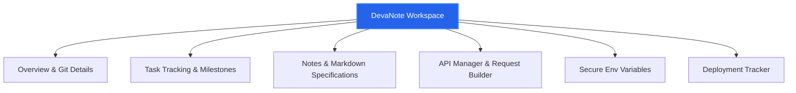

# PRODUCT REQUIREMENT DOCUMENT (PRD)

## Project Name: DevaNote
## Project Subtitle: The All-in-One Workspace for Developers to Plan, Build and Ship Projects.
**Document Version:** 1.0.0  
**Date:** July 6, 2026  
**Status:** Under Review  
**Authors:** Principal Product Manager & Lead Systems Architect  

---

## Table of Contents
1. [Executive Summary](#1-executive-summary)
2. [Problem Statement](#2-problem-statement)
3. [Product Vision](#3-product-vision)
4. [Business Goals](#4-business-goals)
5. [Target Audience](#5-target-audience)
6. [User Personas](#6-user-personas)
7. [User Stories](#7-user-stories)
8. [Product Scope](#8-product-scope)
9. [Success Metrics](#9-success-metrics)
10. [Risks](#10-risks)
11. [Assumptions](#11-assumptions)
12. [Future Vision](#12-future-vision)

---

## 1. Executive Summary

### 1.1 Product Definition
DevaNote is a centralized, local-first and cloud-synchronized developer productivity workspace. It provides a cohesive environment where developers can plan their projects, organize code documentation, track project tasks, configure API requests, manage critical environment variables, and log deployment releases. Rather than distributing project metadata across isolated services, DevaNote consolidates this knowledge into a unified, high-performance developer cockpit.

### 1.2 The Core Problem
Modern software development is fragmented. A single project requires developers to interact with GitHub for code repository management, Jira or Linear for task tracking, Notion or Google Docs for specifications and notes, Postman for API testing, 1Password or local `.env` files for configuration secrets, and Vercel or Render for deployment dashboards. This continuous movement between applications—referred to strictly as "context switching"—degrades developer focus, creates knowledge silos, increases security vulnerabilities (e.g., plain-text environment variables), and introduces configuration drift across environments.

### 1.3 Strategic Importance
DevaNote addresses this inefficiency by creating a single, developer-centric interface that sits directly on top of the development lifecycle. By consolidating these critical operational areas, DevaNote:
- Reduces cognitive friction by keeping tasks, notes, API specifications, environment variables, and deployment records in one responsive dashboard.
- Protects intellectual property and project integrity by providing encrypted, localized storage for environment configurations and API schemas.
- Accelerates onboarding for new team members by establishing a single source of truth for local setup, API routes, and release history.
- Maximizes engineering efficiency by reducing the time spent navigating disparate browser tabs and local system folders.

---

## 2. Problem Statement

### 2.1 The Current Developer Workflow
A typical software developer starts their workday by opening a local integrated development environment (IDE), a command-line terminal, and a web browser. Throughout the day, the developer performs the following operations:
1. **Task Review:** Opens a project management tool (e.g., Jira, Linear) to check current sprint tasks.
2. **Coding & Context:** Reads design specifications and developer notes in a wiki tool (e.g., Notion, Confluence).
3. **Environment Setup:** Opens a terminal to run the local server, copy-pasting environment secrets from a shared vault or private message into a local `.env` file.
4. **API Validation:** Starts an API client (e.g., Postman) to verify response payloads and test endpoint behaviors.
5. **Deployment:** Pushes code to a Git repository, then monitors the build status via a deployment platform's dashboard (e.g., Vercel, Render, AWS).

### 2.2 Pain Points
This fragmented workflow introduces severe friction:
- **High Cognitive Cost of Context Switching:** Research indicates that it takes an average of 23 minutes to refocus after a disruption or context switch. Moving between terminal, IDE, browser tabs, and desktop client applications breaks a developer’s "flow state."
- **Information Fragmentation and Decay:** Project specifications in Notion quickly drift from actual API code implementation. Postman collections are frequently outdated or not shared correctly with other team members. Deployment tracking resides in logs hidden behind build consoles.
- **Security Vulnerabilities:** Environment secrets (e.g., API keys, database credentials) are frequently stored in plain-text `.env` files on developer machines, checked into Git repositories by accident, or shared via insecure chat channels.
- **Onboarding Bottlenecks:** New developers spend days setting up their local environments. They must request access to multiple platforms, locate scattered documentation, request variables, and manually reconstruct API requests.

### 2.3 Real-World Scenarios
- **Scenario A (The Outdated API):** A backend developer updates a user authorization response structure from `user_id` to `userId` and commits the code. The frontend developer, unaware of the schema update, continues using the old field, resulting in application failures during local runtime. The Postman collection was not updated, and the task on the board was marked complete without referencing the schema change.
- **Scenario B (The Compromised Secret):** An engineer needs to test a feature locally using a production-grade API key. They paste the key directly into their local `.env` file. During a git commit, they forget to update the `.gitignore` rules, exposing the credential to a public repository.
- **Scenario C (The Deployment Failure):** A developer deploys a new release to staging, but forgets to update the database URL in the environment variables on the staging host. The build fails. The developer must log into the deployment provider dashboard, trace the build log, navigate to the environment tab, verify the configuration, and trigger a manual rebuild.

---

## 3. Product Vision

### 3.1 Long-term Vision
DevaNote aims to become the universal control center for developers—the unified interface where code planning, execution documentation, API orchestration, and deployment monitoring converge. It acts as the developer's single source of truth, minimizing operational overhead and optimizing the developer experience (DX).



### 3.2 Core Philosophy
- **Developer-First Design (DX):** High performance, keyboard-driven navigation, clean user interface patterns, syntax highlighting, and minimal load times.
- **Local-First and Secure:** Storage of sensitive configurations (such as environment variables and API collections) is isolated, utilizing client-side encryption before synchronization.
- **Pragmatic Consolidation:** DevaNote does not replace Git repositories or cloud servers. Instead, it consolidates the *metadata* and *operational interfaces* associated with those repositories and servers, acting as a lightweight, comprehensive control dashboard.

---

## 4. Business Goals

### 4.1 Short-Term Goals (12 Months)
- **User Adoption:** Acquire 10,000 monthly active users (MAUs) within the indie hacker, freelancer, and student developer segments.
- **Engagement Stability:** Achieve a 30-day user retention rate of 40% or higher.
- **System Reliability:** Maintain zero-data-loss integrity for encrypted environment variables and notes databases.
- **Productivity Gains:** Reduce average developer environment setup and project navigation time by 20% (measured via user feedback surveys).

### 4.2 Long-Term Goals (24–36 Months)
- **Enterprise Expansion:** Introduce secure, team-based workspaces with role-based access control (RBAC).
- **Monetization:** Convert 5% of active users to premium tiers through features like automated team sync, advanced API mock servers, and historical deployment audit logs.
- **Ecosystem Integration:** Establish official integrations with GitHub, GitLab, VS Code, and major cloud providers (AWS, Google Cloud, Vercel, Render) to allow bi-directional data flow.

### 4.3 Success Criteria
| Metric Category | Target Indicator | Measurement Frequency |
| :--- | :--- | :--- |
| **User Acquisition** | 20% MoM growth in registered accounts | Monthly |
| **System Uptime** | 99.9% availability of synchronization APIs | Weekly / Monthly |
| **Core Utility Retention** | Users visiting >3 modules (e.g. Tasks, Notes, APIs) in a single session | Weekly |
| **Customer Support** | Resolution of critical support requests within 4 hours | Continuous |

---

## 5. Target Audience

### 5.1 Students
Students require structured, intuitive, and low-barrier tools to organize coursework, group projects, and personal portfolios. They often work with multiple languages and databases simultaneously, leading to layout confusion. They need a tool that is free or highly cost-effective, helping them build professional engineering habits (like documentation and task management) without the overhead of heavy enterprise tools like Jira.

### 5.2 Freelancers
Freelancers juggle multiple client workspaces. Each project has unique repository links, task deadlines, API requirements, environment variables, and staging URLs. Freelancers need strict workspace isolation to prevent cross-client data exposure, and a single, unified view to switch contexts rapidly as they move from client to client.

### 5.3 Hackathon Teams
Hackathon participants operate in high-pressure, time-constrained environments. They need to spin up collaborative notes, share API endpoints, document environment configurations, and track immediate tasks instantly. Any time spent setting up tools, sharing keys over discord, or debugging out-of-sync API contracts reduces their chances of completing the build on time.

### 5.4 Junior Developers
Junior developers struggle with complex local development setups, environment config drift, and navigating the vast documentation of modern software teams. They benefit from a platform that visualizes the project architecture, provides API examples directly alongside tasks, and keeps the environment configurations clear and structured.

### 5.5 Open Source Contributors
Contributors to open-source software deal with intermittent involvement and need to quickly understand a project's state upon returning. They require access to clear task lists, onboarding notes, and api endpoints to test changes. DevaNote provides them with a structured overview of the project and current open issues.

### 5.6 Indie Hackers
Indie hackers act as solo software developers, product managers, designers, marketers, and operations managers. They build and maintain multiple applications simultaneously. They need to monitor deployments, configure API definitions for their frontend-backend communication, manage environmental keys across hosting platforms, and track launch tasks without buying five separate subscriptions.

---

## 6. User Personas

### 6.1 Persona 1: Alex Chen (Student)
- **Background:** Sophomore Computer Science student at a state university. Actively building personal projects to secure a summer internship.
- **Goals:** Build clean, functional web applications; learn how to structure API requests and manage environment secrets correctly; document project setup for portfolio review.
- **Pain Points:** Finds Jira and Linear overly complex and corporate; struggles to keep track of multiple school assignments, hackathons, and personal side projects; regularly pushes API keys to public GitHub repositories by mistake.
- **Technical Knowledge:** Proficient in JavaScript, basic React, Python, and simple relational databases.
- **Daily Workflow:** Attends lectures, writes code in VS Code, runs local servers, uses browser bookmarks to find tutorials, and uses Apple Notes to write down project ideas.
- **Why DevaNote Helps:** Provides a simple, single-page dashboard where Alex can manage tasks, take markdown notes, and test API endpoints in one location without leaving a clean web interface. DevaNote's environment variable manager keeps secrets safe and organized.

### 6.2 Persona 2: Sarah Jenkins (Freelancer)
- **Background:** Freelance full-stack developer managing 4-6 client contracts concurrently.
- **Goals:** Keep client project files, API credentials, and documentation strictly separated; track deadlines and tasks for multiple deliverables; present clean API documentations to client teams.
- **Pain Points:** Accidentally runs terminal scripts using environment variables from a different client; spends hours searching through emails, Slack messages, and Google Docs to locate client-specific endpoints and configuration guidelines.
- **Technical Knowledge:** High. Expert in Next.js, Node.js, PostgreSQL, AWS, and Serverless architectures.
- **Daily Workflow:** Checks freelance client communications, switches context between repositories, writes code, tests endpoints, manages deployment environments, and logs hours.
- **Why DevaNote Helps:** DevaNote allows Sarah to create completely isolated project workspaces. When she switches to a client’s project in DevaNote, the corresponding tasks, notes, API routes, environment variables, and deployment records are loaded instantly, ensuring context isolation.

### 6.3 Persona 3: Marcus Vance (Hackathon Competitor)
- **Background:** Prototyping engineer who participates in hackathons twice a month. Focuses on rapid feature delivery.
- **Goals:** Set up a collaborative workspace in under 3 minutes; define API contracts between frontend and backend immediately; deploy code to staging and verify builds in real time.
- **Pain Points:** Setting up Trello boards and Postman collections consumes valuable minutes; sharing database strings and authentication keys via Discord is slow and insecure; members write API models that mismatch the actual implementation.
- **Technical Knowledge:** Intermediate-Advanced. Fast builder, skilled in React, Tailwind, Express.js, Firebase, and Vercel.
- **Daily Workflow:** Intense 48-hour sprints, quick mockups, continuous deployments, team alignment meetings, and presentation preparation.
- **Why DevaNote Helps:** Marcus can spin up a DevaNote workspace immediately. The API Manager lets the backend and frontend team agree on schemas instantly. The Task board tracks immediate features, and the Environment variables module keeps their Firebase and API tokens aligned.

### 6.4 Persona 4: Priya Patel (Junior Developer)
- **Background:** Associate Software Engineer at a mid-market financial technology company. Recently transitioned from a coding bootcamp.
- **Goals:** Learn the codebase quickly; understand the flow of data between microservices; avoid breaking the development environment; complete assign tasks on time.
- **Pain Points:** Overwhelmed by the scale of the company's internal documentation; struggles to configure the local environment correctly; hesitates to ask senior developers for help with basic API paths and setup issues.
- **Technical Knowledge:** Junior level. Proficient in HTML, CSS, React, and MongoDB, with basic Git knowledge.
- **Daily Workflow:** Pulls tasks from the backlog, writes component code, runs local tests, reads documentation, and attends daily stands.
- **Why DevaNote Helps:** DevaNote visualizes the workspace, detailing the Overview, setup Notes, APIs, and Tasks. Priya can inspect the API Manager to see exactly how requests and responses should be structured, helping her learn independently without needing constant assistance.

### 6.5 Persona 5: Hiroshi Tanaka (Open Source Contributor)
- **Background:** Senior Software Engineer who maintains several open-source utility packages in his spare time.
- **Goals:** Manage feature requests and bug fixes; write detailed documentation for external contributors; track stable releases and build histories.
- **Pain Points:** Struggles to coordinate roadmap plans with contributors across time zones; managing documentation updates alongside source code is tedious; keeping track of build deployments across multiple staging environments takes too long.
- **Technical Knowledge:** Expert. Deep understanding of Node.js ecosystem, build pipelines, package management, CI/CD, and security patterns.
- **Daily Workflow:** Codes professionally, then spends 1-2 hours in the evenings triaging GitHub issues, reviewing community pull requests, and writing library specifications.
- **Why DevaNote Helps:** DevaNote acts as Hiroshi's localized control center where he can organize feature-specific tasks, write library design notes in the Markdown Notes editor, list test API payloads, and track npm release deployment stages.

### 6.6 Persona 6: Liam O'Connor (Indie Hacker)
- **Background:** Solo founder running three active micro-SaaS web products.
- **Goals:** Build, test, and ship features rapidly; keep subscription costs to a minimum; monitor staging and production deployments across multiple clouds.
- **Pain Points:** High SaaS bill from paying for separate planning tools, documentation wikis, secret storage vaults, and API runners; misses task deadlines because details are scattered across notes apps and bookmarks.
- **Technical Knowledge:** High. Generalist across DevOps, frontend, backend, database design, and server infrastructure.
- **Daily Workflow:** Monitors server health, writes product code, runs marketing campaigns, responds to support requests, and builds new features.
- **Why DevaNote Helps:** DevaNote consolidates everything Liam needs into a single application. He saves money by avoiding paid project management tools and API managers, while maintaining absolute clarity on his build status, API schemas, and next tasks.

---

## 7. User Stories

### 7.1 Authentication & Profile
1. **As a** new developer,  
   **I want to** register for a DevaNote account with my email and password,  
   **So that** I can create a secure workspace and save my projects.
2. **As an** existing user,  
   **I want to** log in securely using my credentials,  
   **So that** my data is retrieved and decrypted correctly.
3. **As a** registered user,  
   **I want to** receive a welcome email immediately upon registration,  
   **So that** I have confirmation that my account is active and receive onboarding tips.
4. **As an** authenticated user,  
   **I want to** view my profile details (name, email, registration date),  
   **So that** I can manage my account details.
5. **As an** authenticated user,  
   **I want to** update my profile name and password from my account settings,  
   **So that** my user profile remains accurate and secure.
6. **As a** user who forgot their password,  
   **I want to** trigger a secure password reset workflow via my email,  
   **So that** I can regain access to my workspace if locked out.
7. **As an** authenticated user,  
   **I want to** securely log out of the application,  
   **So that** my active session is terminated on public or shared computers.

### 7.2 Workspace & Dashboard
8. **As a** developer,  
   **I want to** view a unified dashboard listing all my active projects,  
   **So that** I can get an immediate overview of my entire software portfolio.
9. **As a** multi-project developer,  
   **I want to** create a new project by providing a name, description, and repository URL,  
   **So that** I can isolate all related tasks, notes, and configurations.
10. **As a** project owner,  
    **I want to** update the project metadata (name, description, tags, repo link),  
    **So that** the project information remains current.
11. **As a** project owner,  
    **I want to** delete an active project along with all its nested notes, tasks, and environment variables,  
    **So that** I can clean up my workspace when projects are retired.
12. **As an** active user,  
    **I want to** see an activity feed on the dashboard showcasing recent task updates and deployments,  
    **So that** I can stay updated on recent project modifications.
13. **As a** keyboard-focused developer,  
    **I want to** press a hotkey (e.g., `Cmd/Ctrl + K`) to open a global search bar,  
    **So that** I can quickly navigate between projects without clicking.

### 7.3 Global Search
14. **As a** developer,  
    **I want to** enter a query in the Global Search bar,  
    **So that** I can search for tasks, notes, API routes, and projects across my workspace simultaneously.
15. **As a** user viewing search results,  
    **I want to** click on a search result item,  
    **So that** I am immediately redirected to the correct project and module containing that item.
16. **As a** developer looking for specific tasks,  
    **I want to** filter my search results by type (e.g., only notes or only tasks),  
    **So that** I can locate the required document quickly.
17. **As a** user executing a search,  
    **I want to** see matching text highlighted in the search results,  
    **So that** I understand why the item matched my query.

### 7.4 Project Overview
18. **As a** project developer,  
    **I want to** view a Project Overview tab containing a markdown README,  
    **So that** I can read about the project structure and local setup instructions.
19. **As a** project editor,  
    **I want to** edit the project's README file using a rich markdown editor,  
    **So that** I can document core architectural decisions.
20. **As a** project viewer,  
    **I want to** see quick statistics (number of open tasks, API routes, active deployments) on the Overview screen,  
    **So that** I can assess the project's health at a glance.
21. **As a** team member,  
    **I want to** view the repository link and quick reference links directly on the Project Overview page,  
    **So that** I can jump straight to external assets like GitHub or staging servers.

### 7.5 Task Management
22. **As a** developer,  
    **I want to** add a new task to my project with a title, description, priority, and due date,  
    **So that** I can track features and bugs.
23. **As a** project coordinator,  
    **I want to** view tasks organized by status columns (To Do, In Progress, In Review, Done) on a Kanban board,  
    **So that** I can visualize work distribution.
24. **As a** developer,  
    **I want to** drag and drop tasks between status columns on the Kanban board,  
    **So that** I can quickly update a task's progress.
25. **As an** engineer,  
    **I want to** edit task details (due dates, assignee, descriptions, priority, labels),  
    **So that** the task reflects changing requirements.
26. **As a** user,  
    **I want to** delete tasks that are no longer relevant to the project,  
    **So that** the board remains clean.
27. **As a** developer working on critical items,  
    **I want to** filter my task board by priority (High, Medium, Low),  
    **So that** I can prioritize my immediate daily workload.
28. **As an** engineer,  
    **I want to** assign a task to a specific category or tag (e.g., frontend, backend, bug, feature),  
    **So that** I can group related items together.
29. **As a** developer,  
    **I want to** add subtasks to a parent task,  
    **So that** I can break complex features down into step-by-step checklists.
30. **As a** team member,  
    **I want to** check off subtasks,  
    **So that** the progress percentage of the parent task updates automatically.
31. **As a** developer,  
    **I want to** set a due date reminder,  
    **So that** the system sends me an email alert 24 hours before the task is due.

### 7.6 Notes Management
32. **As a** developer,  
    **I want to** create a new project note with a title and content,  
    **So that** I can write down meeting notes or documentation snippet logs.
33. **As a** developer,  
    **I want to** write my notes using a full markdown editor with side-by-side preview,  
    **So that** I can format my text and include code blocks correctly.
34. **As an** engineer,  
    **I want to** edit existing notes and save the changes,  
    **So that** my documentation remains up to date.
35. **As a** user,  
    **I want to** tag notes with keywords (e.g., database, auth, onboarding),  
    **So that** I can easily filter my notes catalog.
36. **As a** developer,  
    **I want to** delete outdated or duplicate notes,  
    **So that** my project's knowledge base remains relevant.
37. **As a** security-conscious developer,  
    **I want to** lock a note with a password/encryption flag,  
    **So that** sensitive design specifications are hidden from unauthorized users.
38. **As a** writer,  
    **I want to** search for notes by matching words inside their titles or bodies,  
    **So that** I can quickly locate specific snippets.
39. **As a** developer,  
    **I want to** export notes as standalone markdown files (.md),  
    **So that** I can reuse them directly in other wikis or local repositories.
40. **As a** developer,  
    **I want to** pin important notes to the top of my notes catalog,  
    **So that** I have immediate access to standard reference guidelines.

### 7.7 API Manager
41. **As an** integration developer,  
    **I want to** define an API endpoint in the API Manager by specifying its HTTP method (GET, POST, PUT, DELETE, PATCH, etc.) and URL,  
    **So that** I can document the project's external endpoints.
42. **As an** API consumer,  
    **I want to** add request headers, query parameters, and a JSON body to an API configuration,  
    **So that** I can simulate real-world request payloads.
43. **As a** developer,  
    **I want to** click a "Send" button to trigger the API request directly from the DevaNote UI,  
    **So that** I can test the live server without launching Postman.
44. **As a** developer testing endpoints,  
    **I want to** view the API response status code, response time, headers, and formatted JSON response body,  
    **So that** I can debug integration issues.
45. **As a** developer,  
    **I want to** save a history of my API executions,  
    **So that** I can re-run previous requests without configuring them from scratch.
46. **As a** team collaborator,  
    **I want to** group API endpoints into named collections (e.g., Auth APIs, Product APIs),  
    **So that** the project's API surface area remains organized.
47. **As a** developer,  
    **I want to** reference environment variables (e.g., `{{BASE_URL}}`) directly inside my API request configurations,  
    **So that** I can easily toggle tests between local, staging, and production environments.
48. **As a** documentation writer,  
    **I want to** write descriptions for each query parameter, header, and body field,  
    **So that** other developers know how to interact with the API.

### 7.8 Environment Variables
49. **As a** developer,  
    **I want to** add environment variables as key-value pairs assigned to specific environments (e.g., Development, Staging, Production),  
    **So that** I can track configurations across deployment targets.
50. **As a** security-conscious developer,  
    **I want to** mark sensitive environment keys as "secret" so that they are masked visually (e.g., `••••••••`),  
    **So that** I don't accidentally reveal secrets during screen shares.
51. **As a** developer setting up a local server,  
    **I want to** export my environment variable configurations as a downloadable `.env` file,  
    **So that** I can copy it directly into my local development folder.
52. **As a** developer,  
    **I want to** update environment variable keys and values as configuration requirements change,  
    **So that** my deploy environment values remain correct.
53. **As a** developer,  
    **I want to** delete environment variables that are no longer used by the application,  
    **So that** I can prevent credential bloating.
54. **As a** user,  
    **I want to** copy environment variable values to my clipboard via a single click,  
    **So that** I can quickly paste them into configuration interfaces.

### 7.9 Deployment Tracker
55. **As a** release manager,  
    **I want to** register a deployment log by entering a version number, deployment status (Success, Failed, Deploying), deployment target (Vercel, Render, AWS), and a commit hash reference,  
    **So that** I can log build milestones.
56. **As a** release manager,  
    **I want to** update the status of an ongoing deployment manually,  
    **So that** my team knows if a build succeeded or failed.
57. **As an** operations developer,  
    **I want to** view a chronological history of all deployments for a project,  
    **So that** I can quickly trace which release introduced a bug.
58. **As an** on-call developer,  
    **I want to** link a deployment log to specific tasks and issues resolved in that release,  
    **So that** I can see exactly what changed in that build.

### 7.10 Notifications & Support
59. **As a** user,  
    **I want to** submit a support ticket via a contact form by providing my email, category, and description,  
    **So that** I can report bugs and request help from the DevaNote team.

---

## 8. Product Scope

### 8.1 Included Features (MVP)
The following tables list the modules, sub-components, functional requirements, and technical boundaries planned for the DevaNote MVP (Version 1).

#### 8.1.1 Authentication & Profile Manager
| Feature Component | Functional Requirements | Technical Scope / Constraints |
| :--- | :--- | :--- |
| **User Registration** | - Form input validating email syntax and password strength.<br>- Verification email triggered automatically. | Node.js backend using Express validation; storage in MongoDB using bcrypt hashing. |
| **JWT Session Control** | - User login issues a short-lived JSON Web Token.<br>- Tokens stored in secure, HttpOnly cookies to mitigate XSS risks. | Backend middleware checks token integrity on all protected routes. Session expires in 7 days. |
| **Profile Profile** | - Read and update user profile info (name, email).<br>- Password rotation workflow requiring current password verification. | Password hashing strictly handled backend-side; emails verified via regex constraints. |

#### 8.1.2 Unified Workspace Dashboard & Global Search
| Feature Component | Functional Requirements | Technical Scope / Constraints |
| :--- | :--- | :--- |
| **Project Sandbox Grid** | - CRUD control for individual project sandboxes.<br>- Isolated data schemas: tasks, notes, variables belong strictly to a project. | Queries automatically filtered by active `projectId` and authenticated `userId`. |
| **Omnibar Search** | - Hotkey execution (`Ctrl/Cmd + K`) opens modal.<br>- Performs text matching on projects, tasks, notes, and API endpoints. | Backend performs an optimized text index search across multiple collections. |
| **Activity Feed** | - Renders chronological log of operations within a project workspace (e.g., task moves, deployments). | Event hooks log actions to an activity database table on task status change or deployment log. |

#### 8.1.3 Project Overview & Wiki
| Feature Component | Functional Requirements | Technical Scope / Constraints |
| :--- | :--- | :--- |
| **Workspace Info** | - Renders key stats (open tasks, route counts, active environment, target platforms). | Calculations done via MongoDB aggregations, cached client-side for 60 seconds. |
| **Interactive ReadMe** | - Embedded markdown viewer/editor representing the developer handbook or onboarding setup. | Markdown parsed client-side using a safe markdown library. Renders code blocks. |
| **Project Quick Links** | - Catalog of critical links: Git Repository, staging hosts, design assets, API endpoints. | Simple key-value link list; validates URI syntax. |

#### 8.1.4 Task Board (Kanban)
| Feature Component | Functional Requirements | Technical Scope / Constraints |
| :--- | :--- | :--- |
| **State Visualization** | - Kanban board with 4 columns: To Do, In Progress, In Review, Done.<br>- Optional toggle to standard list view. | State managed on client side with optimistic updates for immediate UI responsiveness. |
| **Task Metadata** | - Support for Priority levels (High, Medium, Low).<br>- Labels/Tags, due dates, description fields.<br>- Subtask checklist integration. | Subtasks tracked as nested object arrays inside the parent Task document. |
| **Drag & Drop** | - Move items between columns visually. Updates backend model. | Handled via HTML5 drag-and-drop actions. State synced immediately on release. |
| **Email Reminders** | - Scheduler checks due dates and triggers email alerts 24 hours prior to deadline. | Node-cron or recurring background workers evaluating collection timestamps; Resend email API integration. |

#### 8.1.5 Markdown Notes Editor
| Feature Component | Functional Requirements | Technical Scope / Constraints |
| :--- | :--- | :--- |
| **Dual-Pane Editor** | - Split screen for editing (markdown) and live HTML preview side-by-side. | Client-side markdown processor with syntax highlighting configured for popular languages. |
| **Tagging System** | - Filter notes by tags.<br>- Quick search on titles and keywords. | Array-based tags in schema. Index search optimized for text queries. |
| **Secure Lock** | - Toggle to password-protect notes. Payload encrypted before database storage. | Uses symmetric client-side encryption (AES-GCM) so server cannot read plaintext contents. |

#### 8.1.6 API Manager & HTTP Client
| Feature Component | Functional Requirements | Technical Scope / Constraints |
| :--- | :--- | :--- |
| **HTTP Request Builder** | - Input HTTP Method, URL path, headers, query parameters, and JSON request body. | Client UI includes interactive list rows for headers/params and JSON validator. |
| **Live Request Runner** | - Executes requests to external APIs directly from user's browser or proxied via backend. | Backend proxy option provided to bypass browser CORS constraints when testing external systems. |
| **Environment Variable Binding** | - Interpolate variables dynamically (e.g. replacing `{{HOST}}` with active value). | Regex replacement of `{{KEY}}` patterns from the environment collection before request fire. |
| **Schema Catalog** | - Organize API endpoints into categories.<br>- Save response payload examples for team documentation. | Renders response history records including execution timestamps and status codes. |

#### 8.1.7 Environment Variable Vault
| Feature Component | Functional Requirements | Technical Scope / Constraints |
| :--- | :--- | :--- |
| **Multi-Env Configs** | - Columns/tabs for Development, Staging, and Production keys. | Environment tag binds keys to specific target pipelines. |
| **Secret Masking** | - Hide secret values visually behind masking circles.<br>- Click eye-icon to reveal, or copy-to-clipboard button. | Values masked DOM-side; copy function reads raw data strictly off state memory. |
| **Secure Storage** | - Encryption at rest for all environment values. | Values encrypted using AES-256 on backend prior to write; decrypted on authenticated fetch. |
| **Dotenv Export** | - Single click compiles active environment variables into flat key-value formatting for download. | Client-side generation of local download buffer (.env file). |

#### 8.1.8 Deployment Tracker
| Feature Component | Functional Requirements | Technical Scope / Constraints |
| :--- | :--- | :--- |
| **Milestone Log** | - Record version tag, platform (Vercel, Render, AWS), status, timestamp, and commit hash. | Simple CRUD input logs. |
| **External Redirect** | - Deep links direct developers straight to build consoles or live environments. | Validates URL formatting. |

#### 8.1.9 Contact Support
| Feature Component | Functional Requirements | Technical Scope / Constraints |
| :--- | :--- | :--- |
| **Support Form** | - Inputs: email, issue type, description description.<br>- Submits details to admin dashboard. | Validation ensures description limits (min 20 characters); triggers admin email alert. |

---

### 8.2 Excluded Features (Strictly Deferred from V1)
To ensure high-quality execution of core features, the **Resources Module** (present in early sketches) is **intentionally removed** from DevaNote Version 1. 

**Why Resources are Excluded:**
- *Redundancy:* Developers already store repository URLs in the Project Overview and documentation links inside Notes. A separate Resources collection created duplicate navigation.
- *Prioritization:* Focusing development budget on the **API Manager** (which replaces Postman) and the **Environment Variable Vault** (which replaces unsecured secret stores) provides a significantly stronger core value proposition.

*Other Excluded Features for V1:*
- Real-time collaborative text editing (like Google Docs).
- Bi-directional sync with Git provider issue systems (e.g., pulling GitHub Issues directly as tasks).
- Automatic deployment webhooks from cloud hosting platforms (Vercel/Render).

---

### 8.3 Future Features (Roadmap)
```
[MVP Launch (V1)] ──> [Collaboration & Sync (V2)] ──> [AI & Native Extensions (V3)]
```
- **V2: Team Workspaces:** Real-time web-sockets for shared task boards, multi-user notes, and shared environment vaults with granular user roles (Viewer, Editor, Admin).
- **V2: Native Integrations:** Pulling repository metadata, issues, and PR statuses directly from GitHub/GitLab; automatic deployment logging via CI/CD webhooks.
- **V3: AI Assistant:** Automatic README generator using notes; AI-assisted mock API response builder; auto-generation of OpenAPI specifications.
- **V3: Desktop Client & IDE Extensions:** Local desktop application with file system access, and a VS Code extension displaying DevaNote tasks and environment variables directly inside the editor.

---

## 9. Success Metrics

To measure the health, adoption, and value of DevaNote, the engineering team will monitor the following Key Performance Indicators (KPIs):

### 9.1 Acquisition & Engagement
- **Daily Active Users / Monthly Active Users (DAU/MAU) Ratio:** Target > 0.35, indicating DevaNote is an daily developer utility tool.
- **Time to First Project:** The average duration between account registration and the creation of the user's first project workspace (target < 3 minutes).
- **Active Workspace Growth:** Number of new projects created per user per month.

### 9.2 Feature Usage Rates
- **API Manager Executions:** Count of API requests sent via the HTTP client. High numbers indicate active utilization replacing external desktop clients.
- **Task Velocity:** Average number of tasks transitioned from "To Do" to "Done" per active workspace weekly.
- **Secret Vault Interactions:** Frequency of environment variable copies and dotenv exports, showing value delivery in configuration management.
- **Search Utilization:** Percentage of active sessions utilizing the `Ctrl/Cmd + K` search dialog.

### 9.3 Retention & Operations
- **Day-7 and Day-30 User Retention:** Tracking cohort behavior to ensure value is captured.
- **Sync Latency:** Average time required to save and synchronize note edits and task updates (target < 300ms under standard network conditions).
- **Support Ticket Resolution Time:** SLA tracking to maintain customer trust.

---

## 10. Risks

### 10.1 Technical Risks
- **Data Leakage of Environment Secrets:** Storing environment variables in database collections introduces a prime target for attacks.  
  *Mitigation:* Implement end-to-end encryption. Sensitive values must be encrypted on the client side or immediately on the backend server using industry-standard AES-256 before write. Master keys should never reside in plain text alongside encrypted data.
- **CORS Blockage in API Manager:** Web browsers block cross-origin requests by default. If a developer uses DevaNote's web-based API client to test their local api server (e.g. `http://localhost:5000`), the browser will drop the request due to CORS policies.  
  *Mitigation:* Implement a backend proxy option that users can toggle. The backend server acts as a relay, executing requests to bypass local browser sandbox constraints.
- **Latency in Notes Editor Sync:** Markdown documents can grow large, causing lag during typing if updates are saved continuously.  
  *Mitigation:* Implement client-side debounce mechanisms (e.g., delay sync until typing pauses for 1.5 seconds) and save local edits to browser localStorage as an offline buffer.

### 10.2 Product & Adoption Risks
- **Workflow Interruption Barrier:** Developers are habituated to their existing tools (Postman, Linear, Notion) and may resist moving data to a new platform.  
  *Mitigation:* Build fast import utility tools. Allow developers to upload Postman collections, export markdown notes, and copy/paste environments instantly to reduce onboarding friction.
- **Feature Clutter:** Overloading the single-page application dashboard with six nested workspaces can overwhelm users, degrading usability.  
  *Mitigation:* Maintain a minimalist, navigation-focused design. Allow developers to hide modules they do not use (e.g., disabling the API Manager if they are working on static sites).

---

## 11. Assumptions

- **Internet Access:** It is assumed that while developers write code locally, they have internet access to run synchronization pipelines, trigger welcome emails, and load external components.
- **Developer Machine Capabilities:** Developers run modern browsers (Chrome, Firefox, Edge, Safari) that support HTML5 Drag-and-Drop, local storage APIs, and standard cryptography engines.
- **Third-Party Service Continuity:** Third-party services like Resend (email delivery), Render (backend hosting), and MongoDB Atlas (cloud database) will maintain high uptime during deployment cycles.
- **Collaboration Readiness:** While team-sharing features are postponed to V2, it is assumed the database schema will structure identifiers (e.g., `ownerId` and `teamWorkspaceId`) from day one to simplify the future migration to multi-user access control.

---

## 12. Future Vision

Over the next three years, DevaNote will evolve from a centralized project organizer into an intelligent, native developer platform:

### 12.1 Year 1: Shared Ecosystem and Live Sync
- **Team Workspaces:** Real-time data synchronization across team members.
- **Bi-Directional GitHub Sync:** Linking commits directly to DevaNote task cards and deployment logs automatically.
- **API Sharing:** Shared API collections with versioning and environment variables synced securely across team members.

### 12.2 Year 2: Developer Environment Integrations
- **IDE Extensions:** A native VS Code and JetBrains extension that brings DevaNote's workspace directly into the developer's code editor. Developers can view tasks, update statuses, read notes, and insert environment variables without leaving their code environment.
- **Mobile Companion App:** An iOS and Android application allowing developer leads and managers to view task boards, track ongoing deployment logs, and get emergency pager notifications on the go.
- **Automatic Mock Servers:** The API Manager automatically generates mockup endpoints for any defined endpoint route, allowing frontend developers to build interfaces before backend code is written.

### 12.3 Year 3: Intelligent Developer Agent (AI)
- **AI-Powered Code Setup:** An embedded AI assistant that parses a project's notes and codebase to auto-generate a `.env.example` template, set up a project structure guide, and write local setup instructions.
- **Auto-Documenting APIs:** AI analyzes git commits and code paths to automatically update API Manager catalogs, updating response models and routes without developer intervention.
- **Natural Language Task Management:** Developers can issue commands (e.g., "Create task to upgrade React and assign it to Marcus next Tuesday") via chat or voice, which automatically schedules the task and sends emails.
- **Community Plugin Marketplace:** Opening DevaNote's UI layout to community developers, allowing them to build custom tabs (e.g. Docker container monitors, Kubernetes status logs, Figma embed boards) to extend the workspace.
